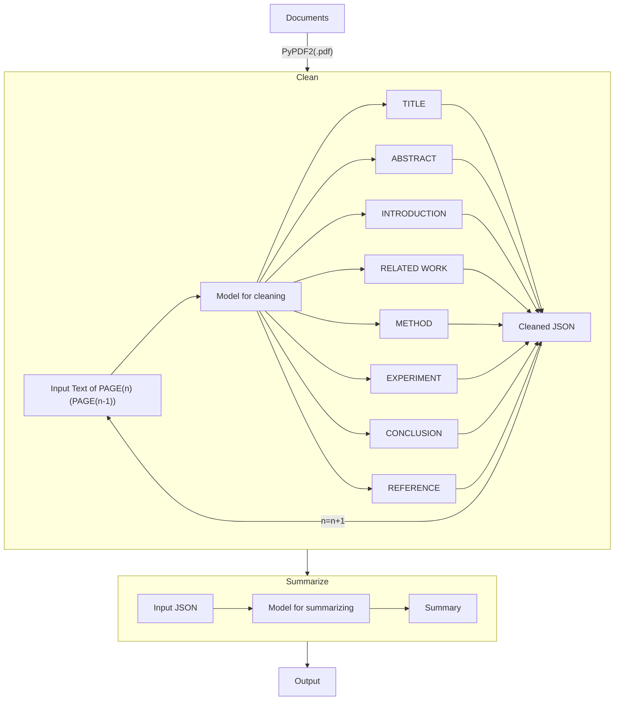

# PAPER READER

## Overview

This is a simple tool for automatically clean and summary papers' documents, which is useful for researchers to quickly understand the main idea of a paper and biuld a knowledge database.

## requirements

- PyPDF2
- tqdm
- openai

## pipeline

### continue plan

- [ ] Build a web service for this tool
- [ ] Construct a knowledge database for papers, which supports search, recommendation, and projection design
- [ ] Add more features for cleaning and summarizing